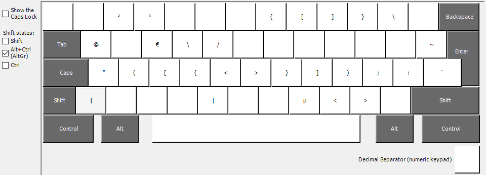

# Dev-Keyboard Layout

This little project is inspired by the web-and-wine talk about [keyboard layouts](https://github.com/web-and-wine/talks/issues/197). I adapted the german keyboard layout with parts of the us layout and parts of the [neo mine](https://neo-layout.org/Layouts/mine/) layout.

## So, what I've done?

In order to keep the german layout with it's umlauts, I've added some new keys in the layer 3 (`ctrl+alt` / `AltGr`), specially for an easier access to dev keys.



### Modify `caps-lock`

To get this works even better, I've remap the `caps-lock` key to `ctrl+alt` by modifying the registry. Yeah sure, this is a bit hacky, but other tools i've tried, like PowerToys keyboard mapper doesn't work.

So to get this work, simply import the `keyboard.reg` or add the following entry to your registry:

```code
Windows Registry Editor Version 5.00
[HKEY_LOCAL_MACHINE\SYSTEM\CurrentControlSet\Control\Keyboard Layout]
"Scancode Map"=hex:00,00,00,00,00,00,00,00,02,00,00,00,38,e0,3a,00,00,00,00,00
```

## Download and Setup

Simply download the `dev-keyboard.zip` and run the installer.

`sha256sum: ac57dccb5de643db35e7807c554166ce9e8551ad9ee11ebd9558fd6b52debd82`

After the installation you can switch your keyboard layout by using `ctrl+shift`.

## Build

You'll need Microsoft Keyboard Layout Creator (MSKLC) to build the keyboard.

## Notes

This was just a quick test with no guarantee that is working correctly on your machine 😉
